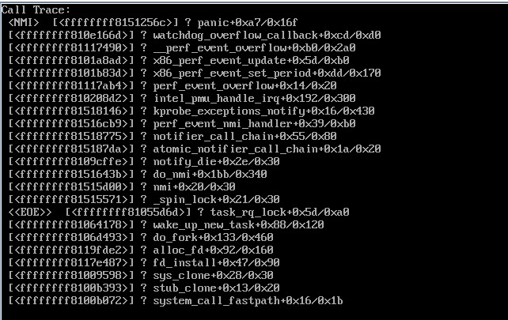


#缘起
初看这个题目你肯定觉得我是蛋疼的可以，没事去跑这么多虚拟机干嘛，但还真心有这样的兄弟有这样的烦恼，今天就遇上一个。搞了这么久OpenStack还没有什么奇葩的问题被问倒过，今天居然有个兄弟问了一个很奇葩的问题，问30多台物理服务器能跑1W个虚拟机不？当时一听1W个，差点没把我吓尿了，而且后面又听了一个数字说只有30台物理服务器。这是干嘛，一问说有个客户要求做这个测试，这……当时我就在想，现在这年头都是什么客户呀，这种需求都有，出于同情，我表示我也没这么玩人的。晚上刚好抽出点空，就在OpenStack上测试了一把，看看具体情况如何。
#瞎折腾
好不容易找到了一台虚拟机相对比较少的服务器，就开始折腾，目前这个服务器的配置如下：
##硬件情况
内存情况：

[root@compute1 ~]#free -m
             total       used       free     shared    buffers     cached
Mem:         48213       6671      41542          0         96       1276
-/+ buffers/cache:       5298      42915
Swap:        24159          0      24159


CPU情况：
	
	一颗：Intel(R) Xeon(R) CPU E5-2650 0 @ 2.00GHz

硬盘情况：
	
	SAS 600G x 12(raid 5)
以上配置，不算豪华，将就这跑虚拟机。

##软件情况
<% highlight sh %>
host_device file raw rbd sheepdog vdi vmdk vpc vvfat
[root@compute1 ~]#qemu-kvm -version
QEMU emulator version 1.2.1 (qemu-kvm-devel), Copyright (c) 2003-2008 Fabrice Bellard
[root@compute1 ~]#libvirtd --version
libvirtd (libvirt) 0.10.2
[root@compute1 ~]#cat /etc/redhat-release
CentOS release 6.4 (Final)
[root@compute1 ~]#uname -a
Linux compute1 2.6.32-358.123.3.openstack.el6.x86_64 #1 SMP Wed Dec 4 14:17:28 UTC 2013 x86_64 x86_64 x86_64 GNU/Linux
<% endhighLight %>
#预备工作
在动手测试之前，先估算和做些热身运动，把一些不必要的问题先排除掉，免得压不死物理机。我的目标很简单，做最后一根压死骆驼的稻草，把骆驼压死就是我的目的。
##估计大概能跑多少
兄弟30几台物理机要跑1W个虚拟机，那对于每个物理机的压力还是挺大的，就拿40台物理机来算。刨除OpenStack管理等节点等，算下来每个物理机需要跑近300个VM，说实话还心里真心没底，玩了这么多年的虚拟化，还真没怎么个玩法的，这是要玩命的冲动呀，估计购买云主机的各位兄弟姐妹们在怀疑现在阿里这个价格搞法，是不是就这么来的。
##如何合理分配内存
机子总共48G内存，现在基本用到8G左右，剩40G左右。如果按照要跑300个虚拟机来算，给每个VM的内存就小的可怜了，100M多点。这要是放在以前，内存也算不错的了（想起当初我的Thinkpad x23，128M内存跑的屁颠屁颠的），但放到现在，100M的内存，够干嘛，估计半个Chrome浏览器都顶不住。
##如何能最大化的跑更多的虚拟机
好了，就这么多内存给你用，CPU估计多半还够用，挑来挑去，OpenStack还得给一个镜像，那就用最经典的cirros镜像，测试利器呀。另外，flavor就自己创建了一个1vcpu,50M内存，1G根分区。
<% highlight sh %>
[root@controller01 ~]#nova flavor-show min
+----------------------------+--------------------------------------+
| Property                   | Value                                |
+----------------------------+--------------------------------------+
| OS-FLV-DISABLED:disabled   | False                                |
| OS-FLV-EXT-DATA:ephemeral  | 0                                    |
| disk                       | 1                                    |
| extra_specs                | {}                                   |
| id                         | c93c632b-3f0f-4576-94a1-11912148ed2f |
| name                       | min                                  |
| os-flavor-access:is_public | True                                 |
| ram                        | 50                                   |
| rxtx_factor                | 1.0                                  |
| swap                       |                                      |
| vcpus                      | 1                                    |
+----------------------------+--------------------------------------+
<% endhighlight %>
突然一想，不行呀，如果给一个C类的地址，满打满算才254个网络地址，还不够300的。还要neutron方面，我直接内部定义了一个网络16位：
	
	| 8fae8491-d161-46ed-a004-79f69d01378b | vm-test          | 1ecb36a0-c7a2-4f1e-af55-f2836e778758 12.11.0.0/16     |

#给KVM加压
这个过程只能用无聊而又乏味来形容，你有不能一下子创建300个（貌似这个和OpenStack的调度和启动KVM虚拟机的过程有关系），只能一部分一部分启动。对了，由于trystack有不少nova-compute节点，只能指定物理机创建虚拟机：
	
	nova boot --flavor min --image cirros --num-instance 60 --availability-zone nova:compute1 --nic net-id=8fae8491-d161-46ed-a004-79f69d01378b huatai
**注意：千万别太贪心了，一下子启动100个以上会适得其反，很多创建失败**

当然如果你一不小心贪心了，也没事，下面我写了一个小脚本帮你做这个事情：

<% highlight sh %>
#!/bin/bash
#@kevin
#when you use this script,pelease import OpenStack env.
#./delete.sh vmname

nova list --name $i|grep ERROR|awk -F'|' '{print $3}'>/tmp/vm-list

for i in `cat /tmp/vm-list`
do
   nova delete $i
done
<% endhighlight %>
你懂的，说明我太贪心了，没什么好处。给KVM加压的过程持续了近一个小时，起虚拟机的过程还是一个漫长的过程。终于发现OpenStack这个批量启动虚拟机真是好生蛋疼，如果哪天需要让我启动几万个虚拟机，估计这个也是需要进行深入的优化，不然估计就应了那句老话：“等的花儿都谢了！”

如果实在闲的蛋疼你可以看看计算节点的负载如何，不看不知道，一看吓一跳，你会发现在批量创建虚拟机的过程中，物理机的CPU的load会特别高，最高的时候的load大概在45左右，说的风趣点是这个时候大概有45个男人要招妓，而市场行情表明，只有16个女郎，而且每个女郎手中都有活，看样子，基本上已经满负荷在用了，别瞎想，此处只说明CPU极度不够用，LOL。
#结局
话说回来，最终还是需要个结论的，结果大家想想都应该猜到了，无非是什么精尽人亡的节奏。在不断的施压的基础上，在虚拟机到达300这个点的时候，已经基本能满足我的要求了，为了上下而求索，最后决定更进一步，在这个数字不断攀升的情况下，兴奋点也不断的提高。终于还是趴下了，在到达360这个点的时候，它还是趴下了，比我预计的要来的早些，本来还想突破400大关。

最后肯定有朋友肯定要说，无图无真相，我只能上套图说明真相，请看高清套图（如果你看到XX就表示对了，LOL）。

最大可承载容量：

纵欲过度照：
