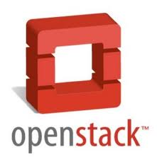


## Preface
那一年我们义无反顾的踏入了挨踢行业。看似光鲜的挨踢行业背后，是一不留神脑子就被驴给踢悲哀。
作为魔都的工作的我，曾经一不留神北漂去了帝都，去了传说中的人寿不断降低的"中关村"。直接导致
我半年之内撤离，在挨踢的这几年发现自己好像什么都没留下。最近我家宝宝即将降临，忍不住窃喜。
于是乎，心头一热，拿起作为挨踢人的武器，写起博客来。

另一方面，最近OpenStack热火朝天，自己也在这个圈子里混了一段时间。也想着写点自己感兴趣的东西，
积累和整理一些有用的东西。一直有朋友要写书，眼看着一直没发动，敝人有些忍不住，就拿起笔留下点
什么，以便今后和大家一起交流学习。

---
## OpenStack
<table width="100%" rowspan="0" colspan="0">
<tr>
<td width="221px"></td>
<td>


<a href="{{ BASE_PATH }}{{ openstack_post.url }}" class="openstack_url">{{ openstack_post.title }} </a>{{ openstack_post.date | date_to_string }} Kevin Zhang
 
{{openstack_post.description}}

<a href="{{ BASE_PATH }}{{ openstack_post.url }}">阅读全文</a>



    <a href="/archive.html">查看所有{{site.posts.size}}篇文章...</a>

</td>
</tr>
</table>

---
## Life
<ul>
  
    <li> {{ life_post.date | date_to_string }}&raquo; <a href="{{ BASE_PATH }}{{ life_post.url }}">{{ life_post.title }}</a></li>
  
</ul>

---
